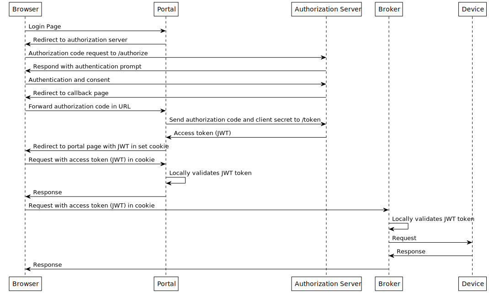

# OAuth Tutorial

## Intruduction

Playground for handling JWT tokens from identity provider.

Right now it implements a flow as like this.

## Usage

Need to have an application and a user in [Home \| Okta
Developer](https://developer.okta.com/). Configure values for okta
domain, client id and client secret in config maps.

Run with
`podman play kube --configmap _conf_broker.yml,_conf_portal.yml --build oauthtut.yml`.

Then visit `http://localhost:8080`

Stop with `podman play kube --down oauthtut.yml`.

## Further reading

-   [Cookie-based Session
    Management](https://davidgorski.ca/posts/sessions/)
-   [Moving from docker-compose to Podman pods \| Enable
    Sysadmin](https://www.redhat.com/sysadmin/compose-podman-pods)
-   [Podman: Managing pods and containers in a local container runtime
    \| Red Hat
    Developer](https://developers.redhat.com/blog/2019/01/15/podman-managing-containers-pods#pods_and_container_management)
-   [Implement authorization by grant type \| Okta
    Developer](https://developer.okta.com/docs/guides/implement-grant-type/authcode/main/#request-an-authorization-code)
